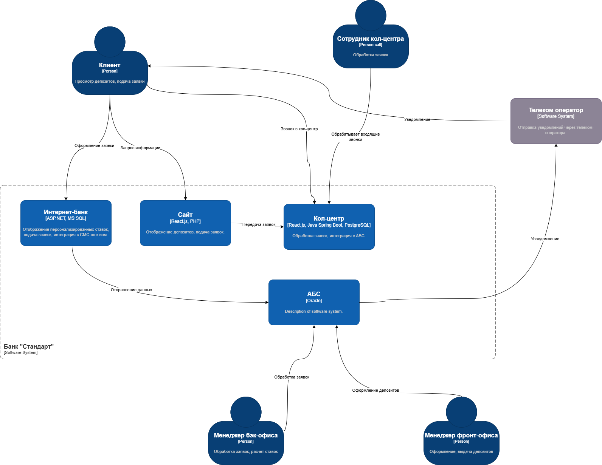

### **Название задачи: Открытие депозитов онлайн для MVP** 
### **Автор: Савинов Никита Станиславович**
### **Дата: 09.03.2025**
### **Функциональные требования**

|**№**|**Действующие лица или системы**|**Use Case**|**Описание**|
| :-: | :- | :- | :- |
|  1  | Клиент | Просмотр доступных депозитов на сайте | Клиент видит список депозитов с актуальными ставками|
|  2  | Клиент | Подача заявки на депозит через сайт | Клиент оставляет Ф.И.О. и номер телефона для связи с кол-центром|
|  3  | Кол-центр | Обработка заявки в системе кол-центра | Менеджер кол-центра изучает заявку и предлагает особые условия клиенту.|
|  4  | Клиент | Просмотр персонализированных ставок в интернет-банке | Авторизованный клиент видит персонализированные ставки по депозитам|
|  5  | Клиент | Подача заявки на депозит через интернет-банк | Клиент указывает счет, сумму и подтверждает операцию через СМС-код|
|  6  | Бэк-офис | Подтверждение условий депозита в АБС | Менеджер бэк-офиса подтверждает ставку и открывает депозит в АБС|
|  7  | Система уведомлений | Отправка СМС-уведомлений клиенту | Клиент получает уведомления о подтверждении ставки и открытии депозита|
### **Нефункциональные требования**

|**№**|**Требование**|
| :-: | :- |
|1|Защита данных шифрованием трафика|
|2|Доступность систем 99.9% времени|
|3|Загрузка данных менее 500 мс|
|4|Использование совместимых технологий|
|5|Минимизация изменений ядра системы интернет-банка|
|6|Горизонтальное масштабирование интернет-банка|
|7|Логирование всех операций для аудита|
### **Решение**

### Диаграмма 

* Минимизация рисков:
    + Использование существующих технологий для минимизации затрат на обучение и внедрение
* Гибкость и масштабируемость:
    + Горизонтальное масштабирование интернет-банка для роста числа пользователей
* Безопасность:
    + Шифрование трафика для защиты чувствительных данных
    + Логирование операций для анализа и аудита
* Удобство использования:
    + Оптимизация интерфейса для быстрого отклика
    + Адаптивный дизайн для мобильных устройств
### **Альтернативы**
* Прямая интеграция интернет-банка с API АБС:
    + Плюсы: Упрощение архитектуры
    + Минусы: Высокая нагрузка на АБС, риск сбоев
* Использование сторонних сервисов для расчета ставок:
    + Плюсы: Уменьшение нагрузки на внутренние системы
    + Минусы: Зависимость от внешних поставщиков

**Недостатки, ограничения, риски**

* Недостатки:
    + Зависимость от подрядчиков для доработки ядра интернет-банка.
    + Вертикальное масштабирование АБС ограничивает производительность.
* Ограничения:
    + Минимальные изменения в ядре интернет-банка.
    + Использование только совместимых технологий.
* Риски:
    + Недостаточная производительность при росте числа пользователей.
    + Возможные сбои при интеграции систем.

